# RFE Website — How to Use the Back Office

> Your guide to updating everything on [rohmfeiferentertainment.net](https://www.rohmfeiferentertainment.net/)
>
> If something breaks or looks weird, don't panic — you can always undo your changes (see [How to undo a mistake](#how-to-undo-a-mistake)).

---

## What is this?

The back office is the private area where you control what appears on the public website. Think of it like a control room behind the scenes — you change things here, and the website updates automatically.

When you log in, you'll see the **Dashboard** — your home base:

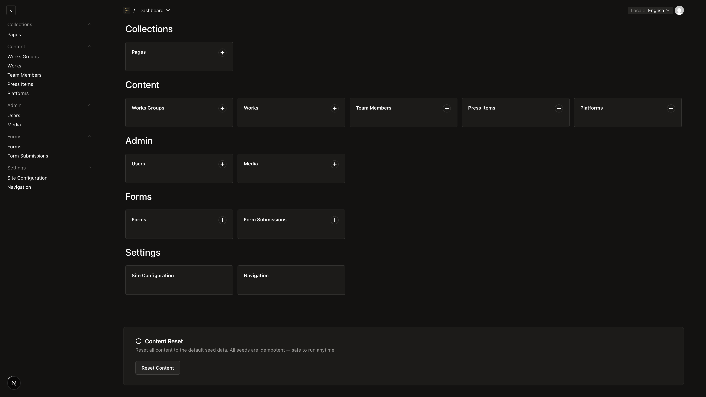

The left sidebar is your menu. Everything is organized into groups:

| Section | What's in it |
|---------|-------------|
| **Pages** | The actual pages of the website (Home, About, Our Work…) |
| **Content** | Your works, team bios, press mentions, and platforms |
| **Settings** | Brand identity, colors, contact info, navigation links |
| **Admin** | User accounts and the image library |
| **Forms** | The contact form and any submissions you've received |

---

## Table of Contents

**The stuff you'll use most:**
1. [Works — Adding and editing your projects](#works)
2. [Works Groups — Controlling what shows where](#works-groups)
3. [Pages — Editing your website pages](#pages)
4. [Team Members — Updating bios and photos](#team-members)
5. [Press Items — Adding press coverage](#press-items)
6. [Platforms — Managing network/streamer logos](#platforms)

**Things you'll touch less often:**
7. [Site Configuration — Brand, colors, SEO, contact info](#site-configuration)
8. [Navigation — Header menu and footer](#navigation)
9. [Media — Your image library](#media)
10. [Users — Admin accounts](#users)
11. [Forms & Submissions](#forms--submissions)

**Help:**
12. [Common tasks step by step](#common-tasks)
13. [How to undo a mistake](#how-to-undo-a-mistake)
14. [How everything connects](#how-everything-connects)

---

# The stuff you'll use most

---

## Works

**This is your catalog.** Every film, series, and unscripted project lives here. It's probably the section you'll update the most.

Each work you add here can show up on [Our Work](https://www.rohmfeiferentertainment.net/our-work), [Development](https://www.rohmfeiferentertainment.net/development), and the [Home](https://www.rohmfeiferentertainment.net/) page — depending on which [Works Group](#works-groups) you put it in.

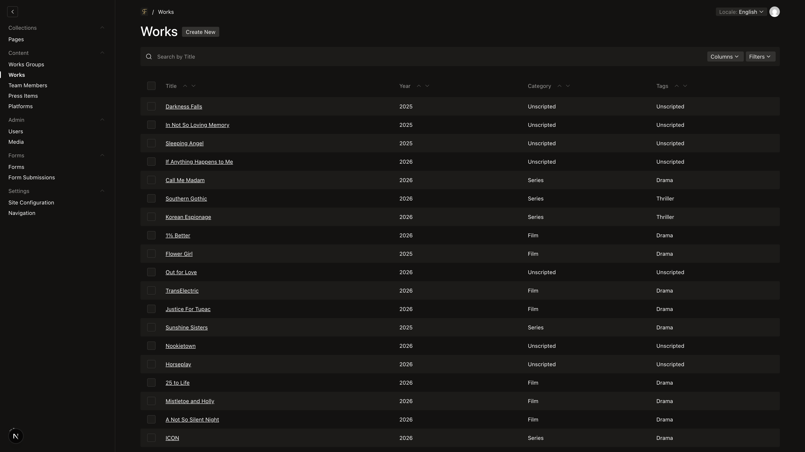

You can see all your projects at a glance — title, year, category (Film / Series / Unscripted), and tags. Use the search bar at the top to find something specific.

### What's inside a work

Click on any title to open it:

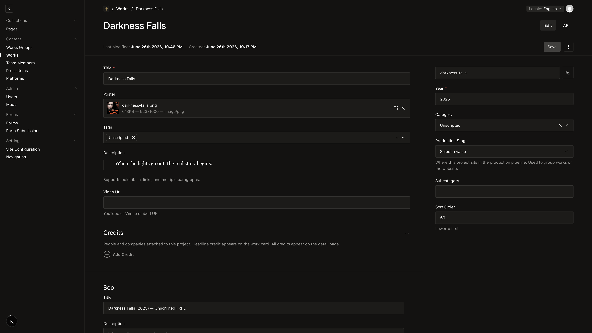

Here's what each field means:

| Field | What to put there |
|-------|-------------------|
| **Title** | The name of the project (e.g. "Darkness Falls"). |
| **Poster** | The main image for this project. Click "Choose from existing" to pick one you already uploaded, or upload a new one. |
| **Tags** | Pick one or more: Drama, Thriller, True Crime, Unscripted. These show up as labels on the website. |
| **Description** | A short description of the project. You can make text **bold** or *italic*. |
| **Video URL** | If you have a YouTube or Vimeo trailer, paste the link here. |

#### Credits

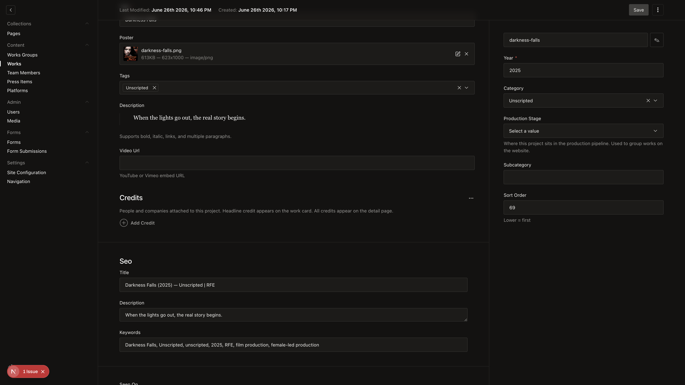

This is where you list the people involved — directors, writers, producers, stars.

For each person, you fill in:
- **Name** — their full name
- **Role** — pick from the dropdown (Director, Writer, Executive Producer, Producer, Star, Showrunner, etc.)
- **IMDb link** — optional, paste their IMDb profile URL
- **Note** — optional, a short note like "Academy Award winner"
- **Headline credit** — check this box if you want this person to show up on the project card (the small tile on the website). If unchecked, they'll only appear when someone clicks into the project detail.

Click **Add Credit** to add more people.

#### SEO (search engine stuff)

You usually don't need to touch this — it gets filled in automatically. But if you want to control what Google shows:
- **Title** — what appears in the browser tab and Google results
- **Description** — the snippet Google shows under the title
- **Keywords** — words people might search for to find this project

#### The sidebar (right side)

| Field | What it means |
|-------|---------------|
| **Year** | The production year. |
| **Category** | Film, Series, or Unscripted. This determines which sections of the website it can appear in. |
| **Production Stage** | Where this project is in the pipeline: Produced, In Production, Paid Development, etc. Used to sort things on the [Development](https://www.rohmfeiferentertainment.net/development) page. |
| **Sort Order** | A number that controls the order. Lower numbers come first. If two projects have the same number, they'll sort alphabetically. |
| **Seen On** | Which networks or streamers carry this project. Click to add platforms like Netflix, CBS, Lifetime, etc. |

### Adding a new work

1. Go to **Content → Works**
2. Click **Create New** (top right)
3. Fill in at least the **Title** and **Year**
4. Add a **Poster** image
5. Set the **Category** (Film, Series, or Unscripted) in the sidebar
6. Add credits if you have them
7. Click **Save**

**Important:** After saving, the work exists in the system but it won't show up on any page yet. You need to add it to a [Works Group](#works-groups) — that's how you control where it appears.

---

## Works Groups

**Think of these as playlists.** A Works Group is just a list of works in a specific order. Each group powers a different section of the website.

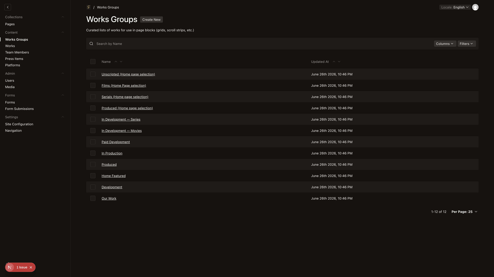

For example:
- The **"Our Work"** group controls what shows on the [Our Work](https://www.rohmfeiferentertainment.net/our-work) page
- The **"Home Featured"** group controls what's highlighted on the [Home](https://www.rohmfeiferentertainment.net/) page
- The **"In Development — Series"** group controls the series tab on the [Development](https://www.rohmfeiferentertainment.net/development) page

### How to add a work to a group

1. Click on the group name (e.g. "Our Work")
2. Scroll down to the **Items** list
3. Click **Add Work**
4. Search for and select the work you want to add
5. **Drag it** up or down to set the order (top = first on the page)
6. Click **Save**

### How to remove a work from a group

1. Open the group
2. Find the work in the list
3. Click the **⋯** menu next to it and choose **Remove**
4. Click **Save**

### How to reorder works in a group

1. Open the group
2. Grab the **drag handle** (the lines icon) on the left of any work
3. Drag it to the new position
4. Click **Save**

---

## Pages

**These are the actual pages of your website.** Each one corresponds to a URL that people visit.

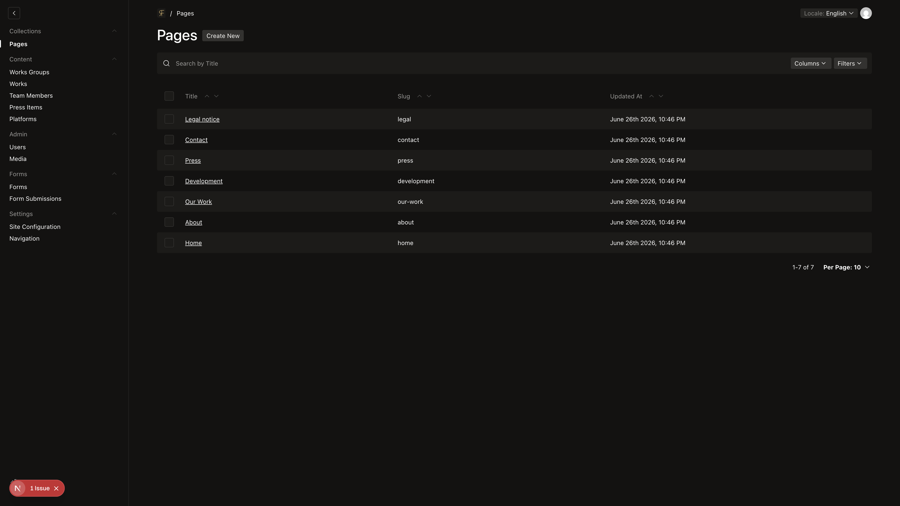

| Page | What people see at |
|------|--------------------|
| Home | [rohmfeiferentertainment.net](https://www.rohmfeiferentertainment.net/) |
| About | [rohmfeiferentertainment.net/about](https://www.rohmfeiferentertainment.net/about) |
| Our Work | [rohmfeiferentertainment.net/our-work](https://www.rohmfeiferentertainment.net/our-work) |
| Development | [rohmfeiferentertainment.net/development](https://www.rohmfeiferentertainment.net/development) |
| Press | [rohmfeiferentertainment.net/press](https://www.rohmfeiferentertainment.net/press) |
| Contact | [rohmfeiferentertainment.net/contact](https://www.rohmfeiferentertainment.net/contact) |
| Legal notice | [rohmfeiferentertainment.net/legal](https://www.rohmfeiferentertainment.net/legal) |

### Editing a page

Click on any page name to open it:

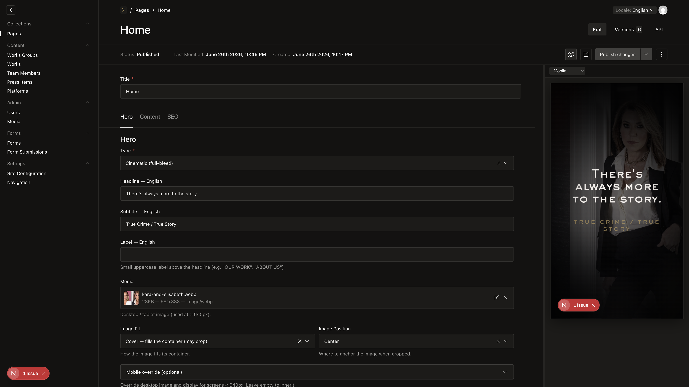

Each page has **three tabs** at the top:

#### Hero (the big image at the top of the page)

This is the first thing visitors see. You can change:
- **Headline** — the main text
- **Subtitle** — smaller text underneath
- **Image** — the background photo
- **Type** — "Cinematic" for a dramatic full-screen look, "Page" for a simpler header, "Minimal" for text only

You can also set a **different image for mobile phones** (in the "Mobile override" section) — useful when a landscape photo doesn't look good on a vertical screen.

#### Content (the body of the page)

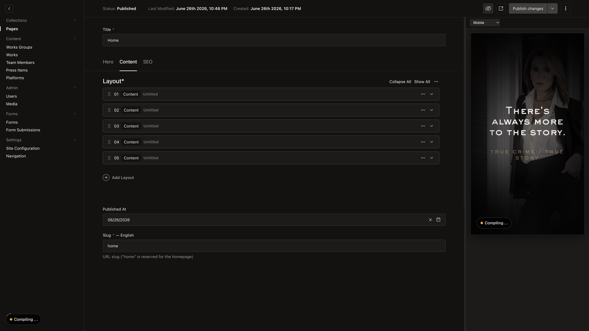

The page content is built with **blocks** — like building blocks you can stack. Each block is a section of the page. They start collapsed (folded up) to keep things tidy — click on one to open it.

The blocks you'll see most:

| Block | What it does |
|-------|-------------|
| **Content** | A text section — the most common one |
| **Works Grid** | Shows a grid of project posters (like on [Our Work](https://www.rohmfeiferentertainment.net/our-work)) |
| **Works Scroll** | A horizontal scroll strip of projects (like on [Home](https://www.rohmfeiferentertainment.net/)) |
| **Featured Work** | Spotlights one project with a quote |
| **Team Showcase** | Shows team members with photos and bios |
| **Press List** | Lists your press coverage |
| **Contact Info** | Shows your email, address, and social links |
| **Contact Form** | The form visitors fill out to reach you |

Most of the time, you won't need to add or remove blocks — the pages are already set up. But you can edit the content inside any block by clicking on it.

Each block also has a **Section Tone** — this is the subtle background shade. All the tones are near-black, but slightly different (warmer, cooler, deeper). This is what gives the site its cinematic feel. The defaults already look great, so you probably don't need to change these.

#### SEO (search engine stuff)

Same as works — controls what Google shows. Usually auto-generated, but you can override if needed.

### Publishing and drafts

On the right side of the page editor, you'll see:

- **Publish changes** — saves your edits AND makes them live immediately
- Click the dropdown arrow next to it → **Save draft** — saves your work but does NOT make it live. The old version stays visible to visitors until you're ready to publish.

Pages also have a **live preview** on the right sidebar — you can toggle between Mobile and Desktop to see what your changes look like before publishing.

---

## Team Members

**Your team page.** Currently Kara and Elisabeth.

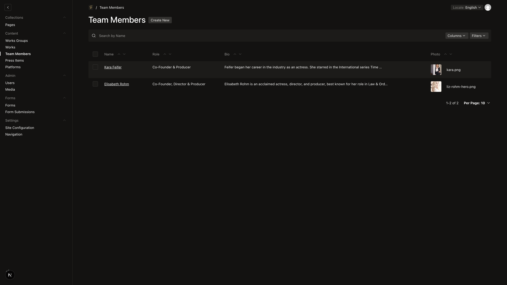

### Editing a team member

Click on a name:

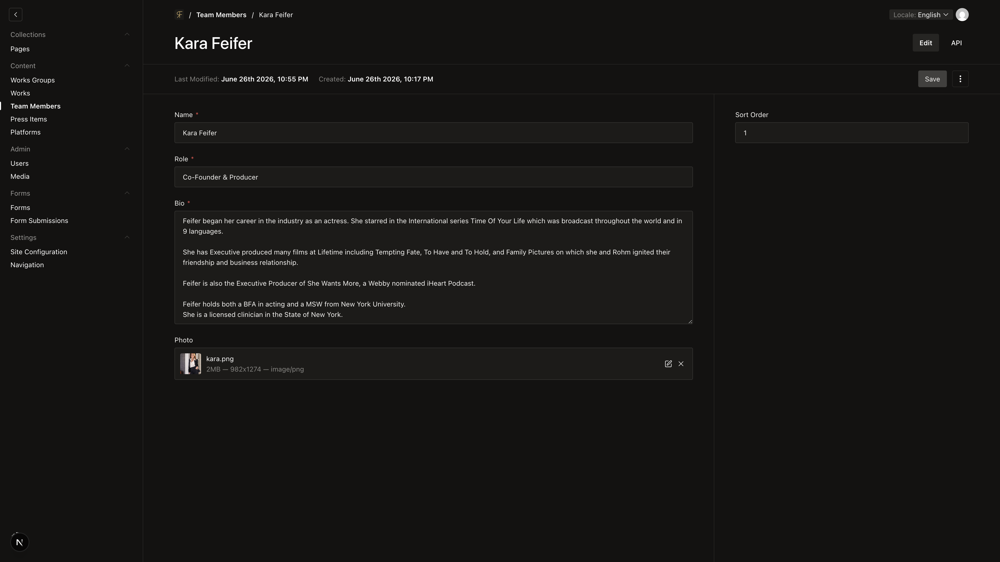

| Field | What to put there |
|-------|-------------------|
| **Name** | Full name |
| **Role** | Title (e.g. "Co-Founder & Producer") |
| **Bio** | Biography text |
| **Photo** | Headshot image |
| **Sort Order** | Who shows first (lower number = first) |

Update what you need, click **Save**, done.

### Adding a new team member

1. Go to **Content → Team Members**
2. Click **Create New**
3. Fill in the name, role, and bio
4. Upload a photo
5. Set the sort order (use 1 for first, 2 for second, etc.)
6. Click **Save**

They'll automatically appear on the [About](https://www.rohmfeiferentertainment.net/about) page.

---

## Press Items

**Press coverage and media mentions.** Each entry is one article or interview.

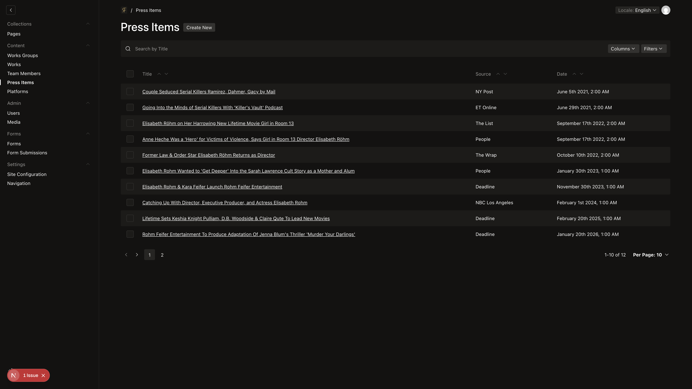

### Editing a press item

Click on any title:

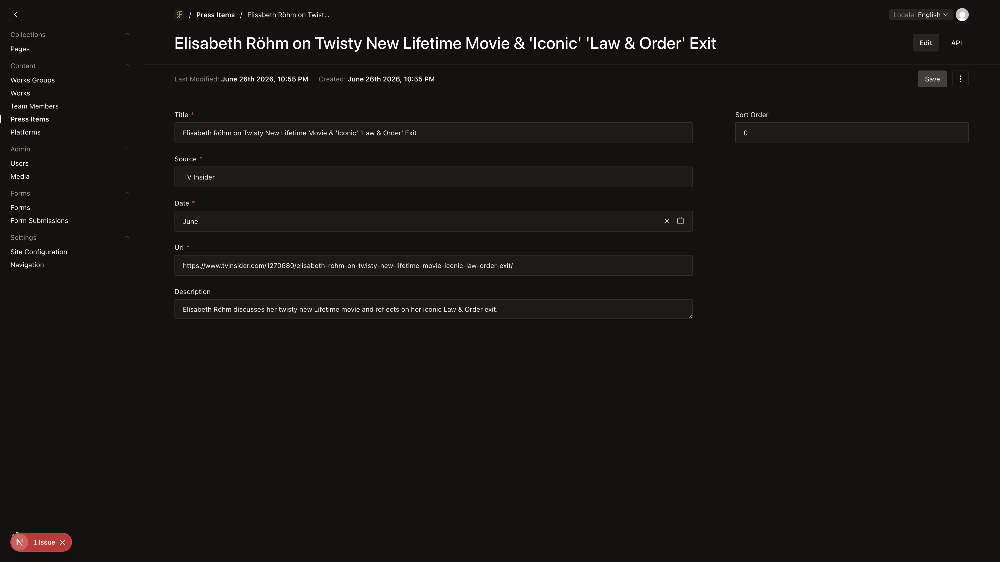

| Field | What to put there |
|-------|-------------------|
| **Title** | The article headline |
| **Source** | Where it was published (e.g. Deadline, People, NY Post) |
| **Date** | When it was published |
| **URL** | Link to the full article |
| **Description** | Optional — a one-line summary |

### Adding a new press mention

1. Go to **Content → Press Items**
2. Click **Create New**
3. Fill in the title, source, date, and URL
4. Click **Save**

It shows up automatically on the [Press](https://www.rohmfeiferentertainment.net/press) page. Most recent items appear first.

---

## Platforms

**Networks and streaming services** — CBS, Netflix, Lifetime, Disney+, etc. These are used to show "Seen On" logos on your project pages.

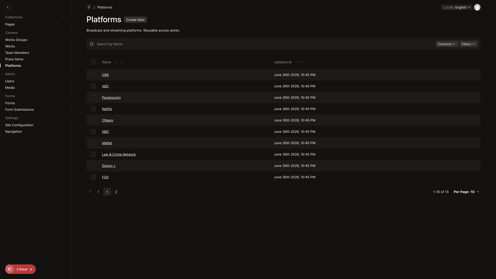

### Editing a platform

Click on any name:

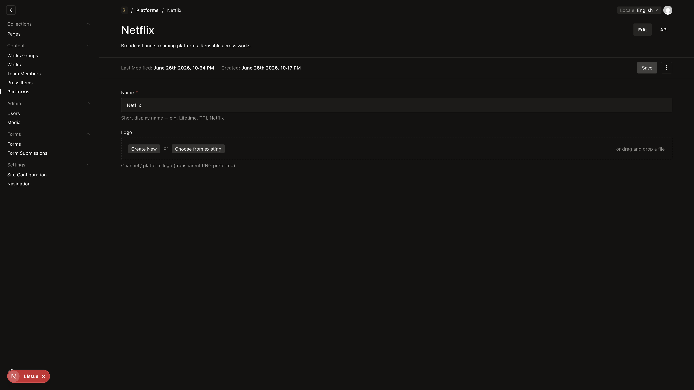

Just two fields:
- **Name** — the platform name
- **Logo** — the logo image (transparent background works best on the dark site)

### Adding a new platform

1. Go to **Content → Platforms** → **Create New**
2. Type the name
3. Upload the logo
4. Click **Save**

After that, you can assign this platform to any work (in the work's "Seen On" field in the sidebar).

---

# Things you'll touch less often

---

## Site Configuration

**The central control panel for your brand.** Colors, tagline, contact details, SEO defaults — it's all here.

Go to **Settings → Site Configuration** in the sidebar.

There are four tabs:

### Brand

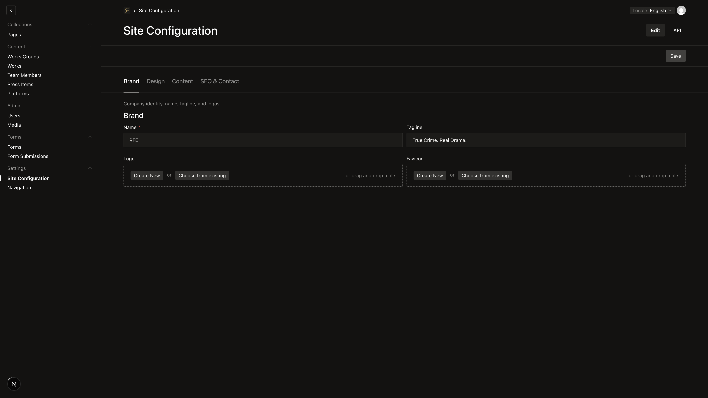

| Field | What it does |
|-------|-------------|
| **Name** | Your brand name. Currently "RFE". |
| **Tagline** | Currently "True Crime. Real Drama." |
| **Logo** | Your site logo. |
| **Favicon** | The tiny icon in the browser tab. |

### Design

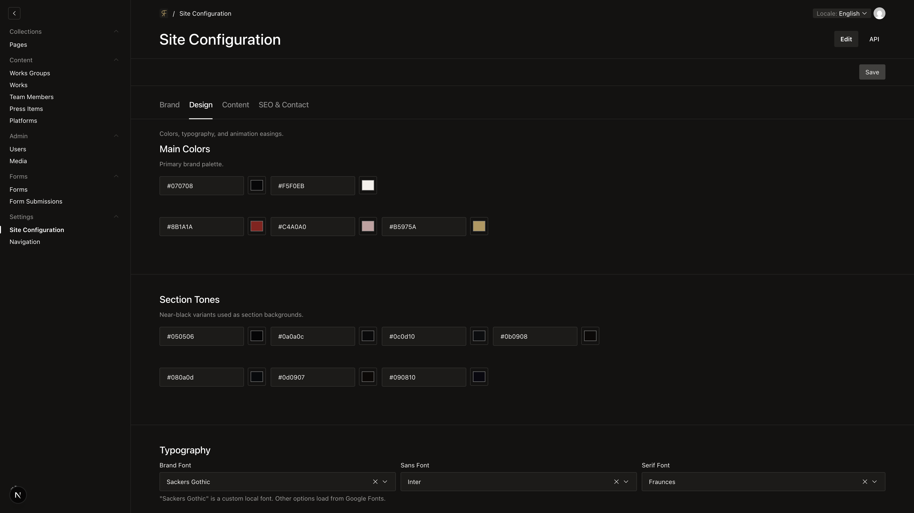

This controls the colors and fonts across the entire website. The current palette was carefully designed for that dark, cinematic look.

**You probably don't need to change any of this** — but if you do want to tweak a color, just edit the hex code (the # followed by letters and numbers). Each color has a small preview square next to it.

The **fonts** (Sackers Gothic, Inter, Fraunces) are also set here.

### Content

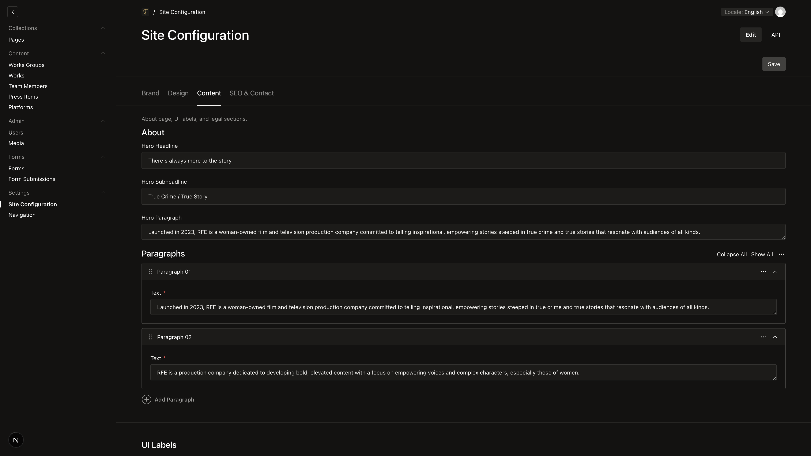

Text that's used in specific places:
- **About section** — the headline, subheadline, and paragraphs for the [About](https://www.rohmfeiferentertainment.net/about) page
- **UI Labels** — button text like "View", "Films", "Series"
- **Legal sections** — the text on the [Legal](https://www.rohmfeiferentertainment.net/legal) page

### SEO & Contact

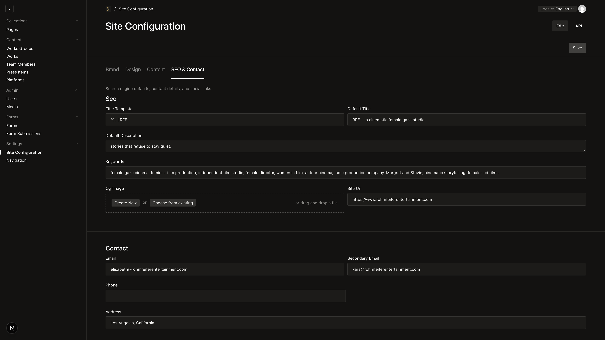

**SEO** controls how your site appears on Google. The defaults are already set up — you only need to change these if you want to update the description or keywords.

**Contact** is where you set your email addresses, phone, and address. These show up on the [Contact](https://www.rohmfeiferentertainment.net/contact) page and in the footer.

**Social links** — your Instagram, IMDb, LinkedIn, etc.

---

## Navigation

**Controls the menu at the top of the website and the footer text.**

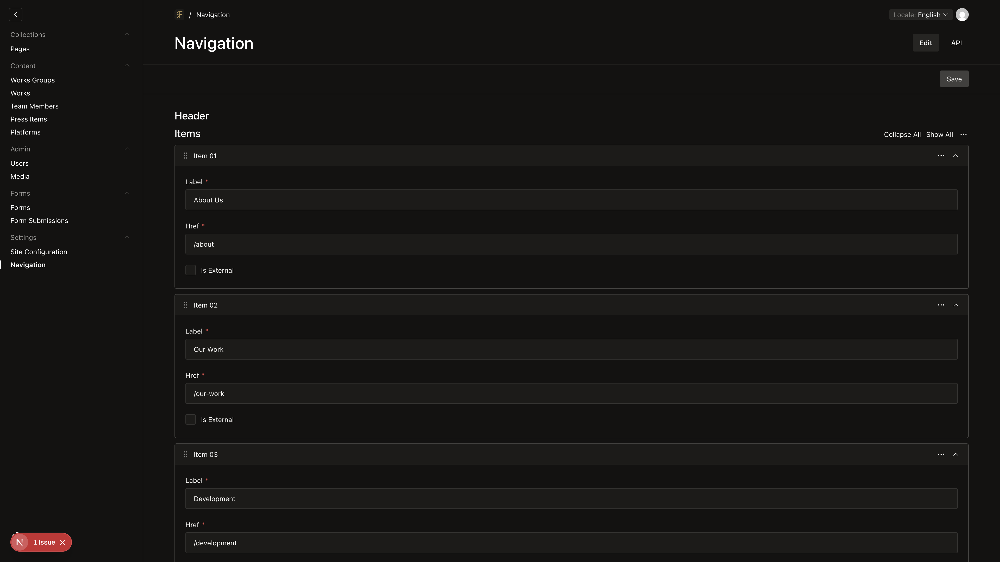

### Header menu

Each menu item has:
- **Label** — the text people see (e.g. "About Us", "Our Work")
- **Link** — where it goes (e.g. `/about`, `/our-work`)
- **External** — check this if the link goes to a different website

You can **drag items** to reorder them. The order here = the order in the menu.

### Footer

- **Legal Label** — the text for the legal notice link
- **Copyright Text** — the copyright line at the bottom of every page

---

## Media

**Your image library.** Every image used on the website is stored here — posters, headshots, logos, hero images, everything.

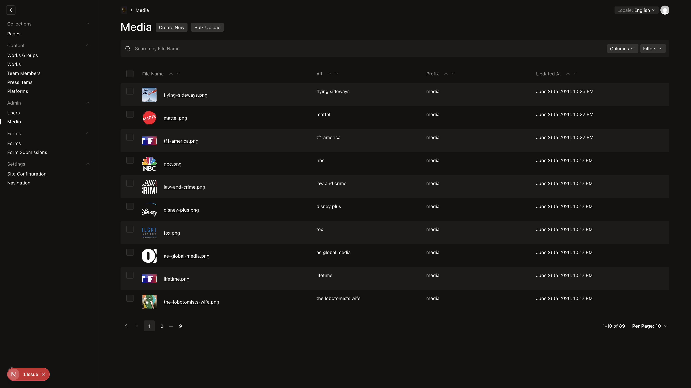

When you upload an image, the system automatically creates several sizes (a small thumbnail for grids, a medium one for detail pages, and a large one for hero sections). You don't need to worry about resizing.

### Uploading images

- Click **Create New** to upload one image
- Click **Bulk Upload** to upload several at once
- Fill in the **Alt text** — a short description of the image (e.g. "Darkness Falls movie poster"). This is important for accessibility and helps with Google search.

**Heads up:** If you delete an image from the library, it will disappear everywhere it's used on the website. If you just want to swap an image, go to the place where it's used (e.g. the work entry) and change it there instead.

---

## Users

**Admin accounts** — people who can log into this back office.

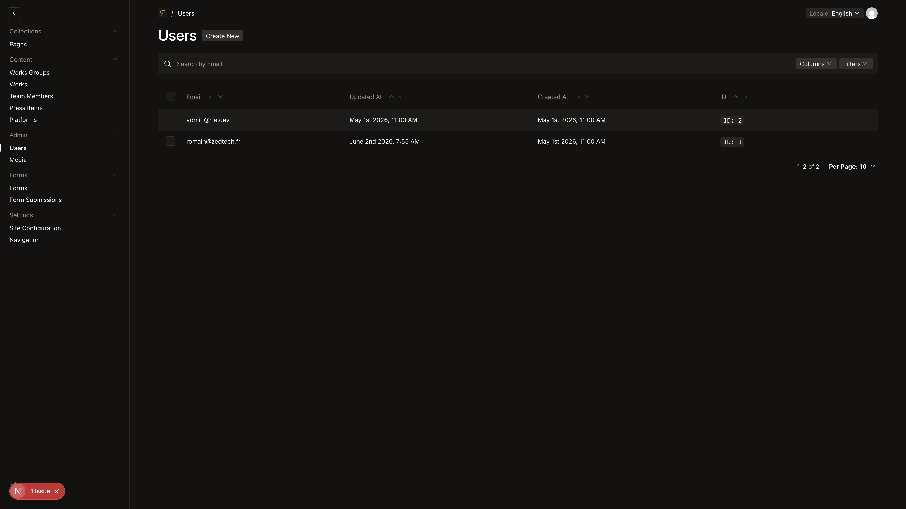

To add a new admin, click **Create New** and enter their email + password.

---

## Forms & Submissions

**Forms** — currently there's one: the "RFE Contact" form on the [Contact](https://www.rohmfeiferentertainment.net/contact) page. It has Name, Email, and Message fields.


**Form Submissions** — every time someone fills out the contact form, their message is saved here. You can check this to see who's reaching out.

---

# Common Tasks

### "I have a new project to add to the website"

1. **Upload the poster:** Go to **Admin → Media** → **Create New** → upload the image → fill in alt text → **Save**
2. **Create the work:** Go to **Content → Works** → **Create New** → fill in title, year, poster, category, tags, credits → **Save**
3. **Add it to the right group:** Go to **Content → Works Groups** → open the group where it should appear (e.g. "Our Work") → **Add Work** → select your new project → drag to position → **Save**

### "I need to update a project's description or poster"

1. Go to **Content → Works**
2. Click on the project name
3. Edit what you need
4. Click **Save**

### "We got new press coverage"

1. Go to **Content → Press Items** → **Create New**
2. Fill in the headline, source (e.g. "Deadline"), date, and URL
3. Click **Save**

### "I want to change the order of projects on a page"

1. Go to **Content → Works Groups**
2. Open the group that controls the page section you want to change
3. Drag projects up or down
4. Click **Save**

### "I want to update our contact email"

1. Go to **Settings → Site Configuration**
2. Click the **SEO & Contact** tab
3. Update the email address
4. Click **Save**

### "I want to add a link to the header menu"

1. Go to **Settings → Navigation**
2. Click **Add Item** at the bottom of the Header section
3. Fill in the label and link
4. Drag it to the right position
5. Click **Save**

### "I want to change the hero image on a page"

1. Go to **Pages**
2. Click on the page
3. In the **Hero** tab, click the **✕** next to the current image to remove it
4. Click **Choose from existing** to pick a new one, or upload a fresh image
5. Click **Publish changes**

---

## How to Undo a Mistake

### On a page (Home, About, Our Work, etc.)

Pages keep a history of every change. If you mess something up:

1. Open the page
2. Click **Versions** (top right, next to "Edit")
3. You'll see a list of every saved version with dates
4. Click on a previous version to preview it
5. Click **Restore this version** to go back to it

### On other content (Works, Team Members, Press Items, etc.)

These don't have version history, but changes are simple to undo manually — just edit the field back to what it was and click **Save**.

### "I accidentally deleted something"

If you deleted a work, team member, or press item, you'll need to recreate it manually. There's no trash or recycle bin. So be careful with the delete button!

**Pro tip:** If the website looks completely wrong, there's a **Content Reset** button on the Dashboard that resets everything to the default content. Use this as a last resort.

---

## How Everything Connects

Here's the simple version of how the pieces fit together:

```
You upload IMAGES to the Media library
        ↓
You create WORKS (with posters, credits, descriptions)
        ↓
You organize works into WORKS GROUPS (like playlists)
        ↓
PAGES use those groups to display works in grids and scroll strips
        ↓
The public WEBSITE shows it all at rohmfeiferentertainment.net
```

Other pieces:
- **Team Members** automatically appear on the About page
- **Press Items** automatically appear on the Press page
- **Platforms** show up as "Seen On" logos on individual works
- **Site Configuration** controls the brand, colors, and contact info everywhere
- **Navigation** controls the header menu on every page

---

## Quick Reference

| I want to... | Go to... |
|--------------|----------|
| Add a new project | Content → Works → Create New |
| Put a project on a page | Content → Works Groups → open the right group → Add Work |
| Change project order | Content → Works Groups → drag items |
| Add press coverage | Content → Press Items → Create New |
| Update a team bio | Content → Team Members → click the name |
| Add a network logo | Content → Platforms → Create New |
| Upload images | Admin → Media → Create New |
| Change contact info | Settings → Site Configuration → SEO & Contact tab |
| Edit the menu | Settings → Navigation |
| Edit a page | Pages → click the page name |
| Undo a page change | Pages → click the page → Versions → Restore |
| See contact form messages | Forms → Form Submissions |

---

*Questions? Reach out to your developer.*

*Last updated: June 2026*
